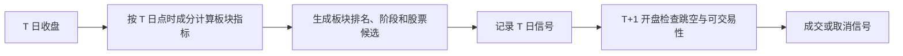

# 板块动量轮动+龙头中军选股策略说明

## 1. 策略目标

本策略每天收盘后只使用当日及以前可获得的数据，对下一交易日的热门板块进行排序：

1. 预测下一交易日热门板块 Top10；
2. 对刚启动的板块选择龙头股；
3. 对已经扩散的板块选择中军股；
4. 最早在下一交易日开盘成交；
5. 单次主动持仓不超过 10 个交易日。

策略支持两种板块口径，可在 Web 回测页选择：

- `sw_l1`：申万 2021 一级行业；
- `ths_concept`：同花顺概念板块。

策略模板 ID 为 `sector_momentum_leader_core`。Web 共暴露 68 个策略参数，包含 1 个板块口径下拉项和 67 个数值参数。版本化的因子权重不在 Web 调整。

Top10 是相对强度候选排名，不是对次日涨跌的承诺；策略只用于 Web 历史回测和研究，不自动下单。

## 2. 信号与成交时序



- T 日计算只能读取 `<= T` 的行情和成分区间。
- 运行时只执行一次 T→T+1 延迟，Builder 和 Strategy 不再重复位移。
- 本策略固定 `deal_price=open`、`signal_lag_days=1`，Web 不提供同日 TailTrade。
- 若 T+1 开盘跳空超过角色阈值，则取消该信号，不使用 T+1 新信息临时换股。

## 3. 板块数据如何避免未来函数

板块成员必须满足：

```text
in_date <= signal_date < out_date
```

申万行业和同花顺概念都使用历史成员区间。股票收益、均线和动量使用复权价格；成交、停牌、涨跌停和开盘跳空使用原始 OHLC。主数据只读本地 PostgreSQL `stock_daily_latest`，不修改外部行情库。

严格回测采用 fail-closed（数据不足时不猜测、不静默回退）：

| 数据情况 | 处理 |
|---|---|
| 历史成员源缺失、`in_date` 缺失或区间重叠 | 回测失败 |
| 核心价格、成交额、ST 或点时成分列缺失，复权因子或单位审计不通过 | 回测失败 |
| 单个板块有效成员数或当日覆盖率不足 | 软排除该板块，记录 `evaluable=false` 及原因 |
| 热身完成后可评估板块少于 `topk_sectors` | 回测失败 |
| 股票角色筛选所需的市值、换手或涨跌停数据不可用 | 该股票不进入角色候选；覆盖不足时软排除板块 |
| 核心行情完整，但某成员 T-1 流通市值不可用 | 该板块当日整体降级为等权，并写入诊断 |

其中：

- 同花顺公开网页只有当前成分且没有生效日期，不能用于严格历史回测；
- 同花顺概念目录本身仍可能存在幸存者偏差，回测结果会明确披露；
- 股票代码进入系统前统一为 `SH600000`、`SZ000001`、`BJ430047` 等前缀格式。

## 4. 第一步：构造可比较的板块指数

每个板块当日有效成员不得少于 Web 参数 `min_board_members`，其下限为 10；覆盖率不得低于 `min_board_coverage`。

板块日收益优先按上一交易日流通市值加权。单个成员的板块收益权重上限为 10%，权重通过 capped-cap water-filling 求解：

```text
w_i = min(0.10, lambda * float_mv_i)
sum(w_i) = 1
```

如果某个有效成员的上一日流通市值缺失，则该板块当日整体降级为等权，并在诊断中记录。有效成员不少于 10 只，因此等权也不会突破 10%。

板块价格指数首个有效日设为 100，此后链式累计：

```text
board_index[d] = board_index[d-1] * (1 + board_return[d])
```

成员进入或退出只改变当天收益篮子，不回填历史、不重新定基。板块 `MA5`、`MA20` 都从这条指数序列计算。

## 5. 第二步：预测明日热门板块 Top10

### 5.1 七个板块指标

每个信号日对所有可用板块做横截面百分位排名，指标如下：

| 指标 | 权重 | 含义 |
|---|---:|---|
| 5 日相对收益 | 25% | 板块相对全 A 的短期强度 |
| 3 日相对加速度 | 15% | 最近 3 日相对收益减去此前 3 日相对收益 |
| MA20 广度 | 15% | 成员收盘价位于各自 MA20 上方的比例 |
| 3 日广度变化 | 15% | 板块上涨扩散速度 |
| 成交额占比/20 日中位数 | 15% | 资金关注度是否提升 |
| 涨停率 | 10% | 板块情绪强度 |
| 近 3 日跑赢天数 | 5% | 强势持续性 |

板块分公式：

```text
board_score = 100 * (
  0.25 * pct_rank(relative_return_5d)
  + 0.15 * pct_rank(relative_acceleration_3d)
  + 0.15 * pct_rank(breadth_ma20)
  + 0.15 * pct_rank(breadth_change_3d)
  + 0.15 * pct_rank(amount_share_vs_median20)
  + 0.10 * pct_rank(limit_up_ratio)
  + 0.05 * pct_rank(outperform_days_3d)
) - crowding_penalty
```

### 5.2 拥挤惩罚

拥挤度由两部分等权组成：

- 板块换手相对 20 日中位数；
- 板块 20 日波动率的横截面百分位。

超过拥挤警戒分位后线性扣分，达到过热分位后标记为 `overheated`，禁止新开仓。

### 5.3 稳定排序

板块按以下顺序排序：

1. `board_score`；
2. 5 日相对收益；
3. 板块代码。

默认取 Top10。Top10 是展示和交易候选池，不代表所有板块都会产生买入信号；只有处于启动期或扩散期并通过风控的板块才会继续选股。

## 6. 第三步：判断板块阶段

阶段优先级固定为：

```text
retreat > overheated > diffusion > launch > watch
```

### 6.1 启动期 `launch`

默认要求：

1. 最近 3 日首次上穿板块 MA20，当前仍在 MA20 上方；
2. 广度在 30%–60%，3 日至少增加 8 个百分点；
3. 涨停 1–2 只，或涨停率在 1%–3%；
4. 成交额占比相对 20 日中位数为 1.15–2.50；
5. 5 日相对收益在 0%–10%，且未过热。

启动期关注先于板块扩散走强的龙头股。

### 6.2 扩散期 `diffusion`

默认要求：

1. 板块指数 `close > MA5 > MA20`；
2. 广度至少 60%，且 3 日变化为正；
3. 涨停至少 3 只或涨停率至少 3%；
4. 板块成交额占比处于全板块 70 分位以上；
5. 板块市值前三股票当日收益中位数为正，量比中位数至少 1.20；
6. 未达到拥挤过热阈值。

扩散期关注容量较大、趋势稳健的中军股。

### 6.3 过热、退潮与观察

- `overheated`：广度至少 80% 且 5 日相对收益超过 12%，或拥挤度达到过热分位；
- `retreat`：`close < MA20` 且广度低于 `retreat_breadth_max`，或 3 日广度变化不高于 `retreat_breadth_delta_max` 且 3 日相对收益不高于 `retreat_relative_return_max`；
- `watch`：不满足上述阶段，只观察、不交易。

## 7. 第四步：启动板块筛选龙头

龙头候选按以下顺序逐步过滤：

1. 剔除 ST、停牌、跌停股票；
2. 流通市值默认 50–300 亿元；
3. 5 日平均成交额至少 3 亿元；
4. 换手率默认 5%–25%；
5. 收盘价在 MA20 上方；
6. 全 A RPS20 至少 85 分位；
7. 当日成交额/5 日均额为 1.2–3.0；
8. 3 日收益为 3%–25%；
9. 近 5 日至少一次涨停，或板块内 5 日收益前 10%；
10. 剔除高位放量长上影。

高位放量长上影定义为量比和上影线比例同时超过 Web 阈值：

```text
upper_shadow_ratio = (high - max(open, close)) / max(high - low, eps)
```

过滤后按以下指标评分：

| 龙头指标 | 权重 |
|---|---:|
| 涨停/身位代理 | 25% |
| RPS20 | 20% |
| 3 日收益 | 15% |
| 健康量比 | 15% |
| 收盘位置 | 10% |
| 抗跌性 | 10% |
| 市值适配度 | 5% |

每个启动板块默认选 1 只龙头。

## 8. 第五步：扩散板块筛选中军

中军候选按以下顺序逐步过滤：

1. 剔除 ST、停牌、涨停和跌停股票；
2. 流通市值至少 100 亿元，且为板块前三或前 20%；
3. 5 日平均成交额至少 10 亿元；
4. `close > MA20` 且 `MA5 >= MA20`；
5. 20 日年化波动率默认 25%–50%；
6. 20 日最大回撤不低于 -12%；
7. 当日成交额/5 日均额为 1.1–2.5；
8. 5 日收益不超过 20%。

过滤后按以下指标评分：

| 中军指标 | 权重 |
|---|---:|
| 流通市值排名 | 20% |
| 成交额排名 | 20% |
| 趋势稳健度 | 20% |
| 量能 | 15% |
| 低回撤 | 15% |
| RPS20 | 10% |

每个扩散板块默认选 1 只中军。在没有公告日点时财务库的情况下，不使用 ROE、营收增速或机构持仓。

## 9. 第六步：形成组合

股票综合分：

```text
stock_score = 0.60 * board_score + 0.40 * role_score
```

同一股票属于多个概念时只保留综合分最高的一条记录，然后取 `topk_stocks`，默认最多 10 只。

- 默认等权；
- 单票仓位默认不超过 10%；
- 单板块仓位默认不超过 20%；
- 现金不强行补满；
- 全 A MA20 广度低于 `market_breadth_reduce` 时降低总仓位；
- 低于 `market_breadth_pause` 时暂停新开仓。

## 10. 第七步：退出与最长持仓

任一条件满足时产生下一可交易日开盘退出指令：

- 收盘止损；
- 龙头/中军从持仓期最高收盘回撤达到移动止盈阈值；
- 一次跌破 MA20，或连续两日跌破 MA5；
- 所属板块连续若干日跌出退出排名；
- 板块分相对入场信号下降达到阈值；
- 板块进入 `overheated` 或 `retreat`；
- 启动转扩散时退出龙头，下一日可重新按中军规则入场；
- 达到 `max_holding_days`，默认和上限均为 10 个交易日。

持仓年龄以首次实际买入成交为准，入场交易日记为第 1 日。重复入选、补仓和部分卖出不会重置年龄；完全清仓后再次买入才重新计龄。若停牌或跌停导致卖不出，策略保留原年龄，记录 `forced_exit_blocked`、后续重试、恢复与完成事件。这属于被动超期，不能计为策略主动持有；回测结束仍未卖出时，诊断保留阻塞原因和重试次数。

## 11. Web 可配置内容

Web 会按模板元数据渲染全部 68 个参数的中文名称、说明和默认值；数值参数同时提供最小值、最大值和步长。完整参数集如下：

| 类别 | 数量 | 参数 |
|---|---:|---|
| 板块、排名与运行 | 8 | `board_universe`、`topk_sectors`、`topk_stocks`、`lookback_days`、`min_board_members`、`min_board_coverage`、`max_holding_days`、`rebalance_days` |
| 组合、市场广度与拥挤 | 8 | `max_stock_weight`、`max_board_weight`、`weak_market_position`、`market_breadth_reduce`、`market_breadth_pause`、`crowding_warning_quantile`、`crowding_overheat_quantile`、`crowding_penalty_max` |
| 启动期 | 11 | `launch_breadth_min`、`launch_breadth_max`、`launch_breadth_delta_min`、`launch_limit_count_min`、`launch_limit_count_max`、`launch_limit_ratio_min`、`launch_limit_ratio_max`、`launch_amount_ratio_min`、`launch_amount_ratio_max`、`launch_relative_return_min`、`launch_relative_return_max` |
| 扩散、过热与退潮 | 10 | `diffusion_breadth_min`、`diffusion_limit_count_min`、`diffusion_limit_ratio_min`、`diffusion_amount_quantile_min`、`core_start_amount_ratio_min`、`overheat_breadth_min`、`overheat_relative_return_min`、`retreat_breadth_max`、`retreat_breadth_delta_max`、`retreat_relative_return_max` |
| 龙头筛选 | 12 | `leader_float_mv_min`、`leader_float_mv_max`、`leader_amount_min`、`leader_turnover_min`、`leader_turnover_max`、`leader_rps_min`、`leader_amount_ratio_min`、`leader_amount_ratio_max`、`leader_return_3d_min`、`leader_return_3d_max`、`leader_upper_shadow_amount_ratio`、`leader_upper_shadow_ratio` |
| 中军筛选 | 9 | `core_float_mv_min`、`core_mv_top_quantile`、`core_amount_min`、`core_volatility_min`、`core_volatility_max`、`core_drawdown_min`、`core_amount_ratio_min`、`core_amount_ratio_max`、`core_return_5d_max` |
| 开盘过滤与退出 | 10 | `leader_gap_down`、`leader_gap_up`、`core_gap_down`、`core_gap_up`、`stop_loss`、`leader_trailing_stop`、`core_trailing_stop`、`board_exit_rank`、`board_exit_days`、`board_score_drop_exit` |

`board_universe` 是下拉选择，可切换 `sw_l1`（申万 2021 一级行业）与 `ths_concept`（同花顺 A 股概念）。其余 67 项为数值参数。所有比例和收益使用小数，金额和市值使用人民币元。

后端还会校验大小边界和跨字段关系，例如下限必须小于上限、暂停开仓广度必须低于降仓广度、拥挤预警分位必须低于过热分位、单票上限不得高于单板块上限，以及 `max_holding_days <= 10`。非法组合不会进入回测。

以下不是可调参数，而是策略的安全固定项：

- `deal_price=open`：使用下一交易日开盘价成交；
- `signal_lag_days=1`：T 日信号只在 T+1 生效。

Web 锁定这两项，后端请求校验也会强制覆盖，以防止绕过页面造成同日收盘前视。因子权重固定在 `MODEL_SPEC_V1`，也不属于 Web 参数。

## 12. 数据限制与风险

- 日线数据无法可靠得到最早封板时间、封单金额、竞价量、开盘 30 分钟主动买单等信息，本策略不伪造这些字段；
- 没有点时财务披露库时，不使用未来才披露的财务或机构数据；
- 同花顺概念目录可能存在目录层面的幸存者偏差；
- 热门板块排名是相对强度模型，不保证下一日上涨；
- 快速轮动、涨跌停、停牌和成交容量会使理论信号与实际成交产生偏差；
- 回测应同时关注交易成本、换手率、容量、样本外表现和参数稳定性，不能只看累计收益。

本策略当前用于历史回测和研究，不自动连接实盘下单。
